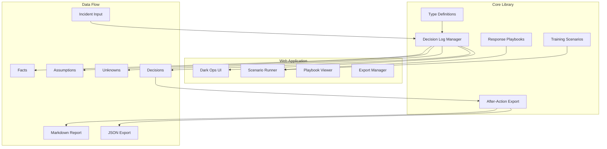

# GSOC Decision Ops

**First-hour operational decision toolkit for corporate Global Security Operations Center (GSOC) leaders facing vendor compromises and cyber-adjacent disruptions.**

[](https://www.typescriptlang.org/)
[](./LICENSE)
[](#testing)

---

## The Problem

When a critical security vendor experiences a breach, ransomware attack, or significant operational disruption, corporate GSOC leaders face a cascade of decisions under conditions of **incomplete information** and **time pressure**.

Traditional incident response frameworks focus on the technical investigation. But for GSOC operations, the first hour is about something different:

- **Can we continue operating?** Badge systems, video surveillance, alarm monitoring—what still works?
- **What do we actually know vs. what are we assuming?** The vendor says "investigating"—what does that mean for our operations?
- **Who needs to know, and what do we tell them?** Executive briefing in 30 minutes—what's the message?
- **When do we revisit this decision?** What would change our posture?

This toolkit provides a structured framework for making and documenting these operational decisions.

---

## Thesis

> **Decision quality in the first hour is not about having perfect information—it's about knowing what you don't know and making defensible choices anyway.**

The GSOC Decision Ops toolkit embodies three principles:

1. **Separate facts from assumptions from unknowns.** Under pressure, teams conflate what they know with what they're guessing. This toolkit forces explicit categorization.

2. **Document decisions with posture and rationale.** Every decision is CONTINUE, DEGRADE, or PAUSE—with clear reasoning that can be reviewed and revised.

3. **Maintain audit trail for after-action.** When the incident is over, you have structured data for lessons learned, not scattered Slack messages.

---

## Architecture



### Decision Posture Model

| Posture      | Meaning                         | When to Use                                                           |
| ------------ | ------------------------------- | --------------------------------------------------------------------- |
| **CONTINUE** | Proceed with normal operations  | Risk understood and acceptable; enhanced monitoring may be warranted  |
| **DEGRADE**  | Operate with reduced capability | Accept temporary limitations to manage risk; backup procedures active |
| **PAUSE**    | Halt affected operations        | Risk unacceptable or critical unknowns require resolution first       |

### Information Quality Framework

```
┌─────────────────────────────────────────────────────────────────┐
│                    INFORMATION QUALITY                          │
├─────────────────┬─────────────────┬─────────────────────────────┤
│     FACTS       │   ASSUMPTIONS   │         UNKNOWNS            │
│  (Confirmed)    │  (Working)      │    (Must Resolve)           │
├─────────────────┼─────────────────┼─────────────────────────────┤
│ • Source noted  │ • Basis stated  │ • Priority assigned         │
│ • Confidence    │ • Risk if wrong │ • Owner designated          │
│ • Verification  │ • Validation    │ • Target resolution         │
│   tracked       │   plan          │   time                      │
└─────────────────┴─────────────────┴─────────────────────────────┘
```

---

## Quick Start

### Prerequisites

- Node.js 18+
- npm 9+

### Installation

```bash
# Clone the repository
git clone https://github.com/swb2019/gsoc-decision-ops.git
cd gsoc-decision-ops

# Install dependencies
npm install

# Build the core library
npm run build --workspace=packages/core

# Start the development server
npm run dev
```

The web application will be available at `http://localhost:3000`.

### Running Tests

```bash
# Run all tests
npm test

# Run tests with coverage
npm run test:coverage --workspace=packages/core
```

---

## Project Structure

```
gsoc-decision-ops/
├── packages/
│   └── core/                    # TypeScript core library
│       ├── src/
│       │   ├── types.ts         # Type definitions
│       │   ├── decision-log.ts  # Decision log management
│       │   ├── export.ts        # After-action report generation
│       │   ├── utils.ts         # Utility functions
│       │   ├── playbooks/       # Response playbooks
│       │   └── scenarios/       # Synthetic training scenarios
│       └── package.json
├── apps/
│   └── web/                     # Next.js web application
│       ├── src/
│       │   └── app/             # App router pages
│       └── package.json
├── examples/                    # Sample after-action reports
├── .github/
│   └── workflows/               # CI/CD configuration
└── package.json                 # Workspace root
```

---

## Core Library Usage

### Creating a Decision Log

```typescript
import { createDecisionLog, addFact, recordDecision } from '@gsoc-decision-ops/core';

// Initialize a new decision log
let log = createDecisionLog({
  title: 'Access Control Vendor Security Incident',
  description: 'Vendor reports potential unauthorized access to cloud infrastructure',
  severity: 'HIGH',
  impactCategories: ['ACCESS_CONTROL', 'PHYSICAL_SECURITY'],
  reportedBy: 'Vendor Account Manager',
  createdBy: 'GSOC Manager',
  organization: 'Your Organization',
});

// Add verified facts
log = addFact(
  log,
  'Vendor confirmed incident at 14:32 UTC',
  'Vendor email notification',
  'CONFIRMED'
);

// Record a decision
log = recordDecision(log, {
  title: 'Suspend automated badge provisioning',
  description: 'Halt all automated badge credential creation pending vendor all-clear',
  posture: 'DEGRADE',
  owner: 'GSOC Manager',
  ownerRole: 'Incident Commander',
  rationale: 'Precautionary measure until scope of vendor breach is understood',
  reviewTrigger: 'Vendor provides scope assessment',
});
```

### Generating After-Action Reports

```typescript
import { generateAfterActionReport, exportToMarkdown, exportToJSON } from '@gsoc-decision-ops/core';

const report = generateAfterActionReport(
  log,
  ['Vendor communication SLA was not met'],
  ['Establish secondary contact method for critical vendors']
);

// Export as Markdown
const markdown = exportToMarkdown(report);

// Export as JSON
const json = exportToJSON(report);
```

### Using the Vendor Compromise Playbook

```typescript
import { getVendorCompromisePlaybook, getPhaseChecklist } from '@gsoc-decision-ops/core';

const playbook = getVendorCompromisePlaybook();

// Get Phase 1 checklist items
const phase1Checklist = getPhaseChecklist('PHASE_1_ASSESSMENT');
```

---

## Synthetic Training Scenarios

The toolkit includes three synthetic scenarios for training purposes:

| Scenario                         | Severity | Description                                             |
| -------------------------------- | -------- | ------------------------------------------------------- |
| Access Control Vendor Ransomware | HIGH     | Badge system vendor experiences ransomware attack       |
| Video Management Supply Chain    | HIGH     | Anomalous VMS behavior suggests supply chain compromise |
| Alarm Monitoring Outage          | CRITICAL | Third-party alarm monitoring infrastructure failure     |

All scenarios are explicitly marked as synthetic/fictional. Vendor names are fictional.

---

## Design Principles

### 1. Human-in-the-Loop Governance

This toolkit supports human decision-makers—it does not replace them. All decisions require human judgment, organizational authority, and contextual awareness that no framework can provide.

### 2. Defensible Decision Documentation

Every decision captures:

- What was decided (posture and scope)
- Who made the decision (owner and role)
- Why it was made (rationale)
- What would change it (review triggers)

### 3. Information Quality Awareness

The framework forces explicit acknowledgment of:

- What we know (facts with sources)
- What we're assuming (with risks if wrong)
- What we don't know (prioritized unknowns)

### 4. After-Action Utility

Decision logs are designed to produce useful after-action reports—not bureaucratic paperwork, but genuine learning artifacts.

---

## What This Is NOT

- **Not a SIEM or security monitoring tool.** This toolkit doesn't detect threats or collect logs.
- **Not an incident response automation platform.** It documents human decisions, not automated responses.
- **Not a vendor management system.** It focuses on the decision moment, not ongoing vendor relationships.
- **Not a replacement for organizational policies.** Your organization's procedures take precedence.
- **Not production incident documentation.** These are training scenarios only.

---

## Screenshots

### Dashboard

Dark ops aesthetic with real-time incident status, decision metrics, and timeline.

### Decision Recording

Structured decision capture with posture selection, rationale documentation, and review triggers.

### Playbook Execution

Interactive checklist with phase progression, key questions, and escalation triggers.

### After-Action Export

Generate comprehensive Markdown and JSON reports for documentation and analysis.

---

## Contributing

See [CONTRIBUTING.md](./CONTRIBUTING.md) for guidelines on contributing to this project.

---

## Security

See [SECURITY.md](./SECURITY.md) for security policy and vulnerability reporting.

---

## License

MIT License. See [LICENSE](./LICENSE) for details.

---

## Acknowledgments

This toolkit was developed to support training and professional development in corporate security operations. It reflects real operational challenges faced by GSOC teams during vendor-related disruptions.

---

<p align="center">
  <strong>GSOC Decision Ops</strong><br/>
  <em>Structured decisions under incomplete information.</em>
</p>
