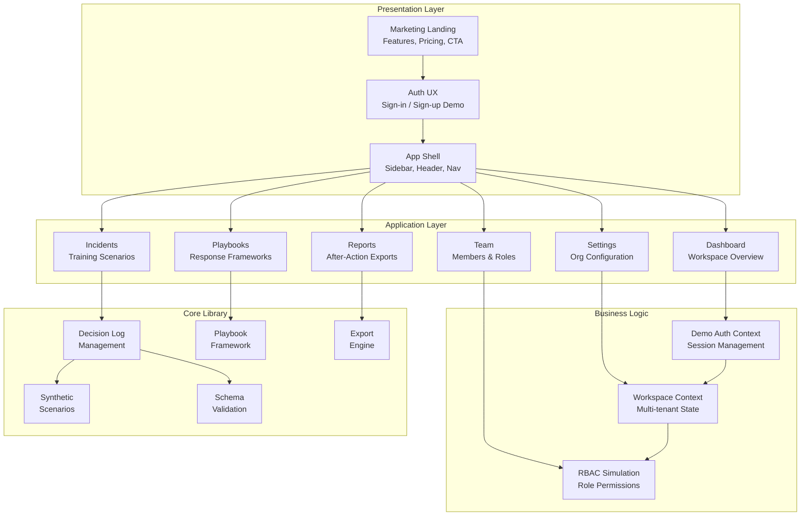
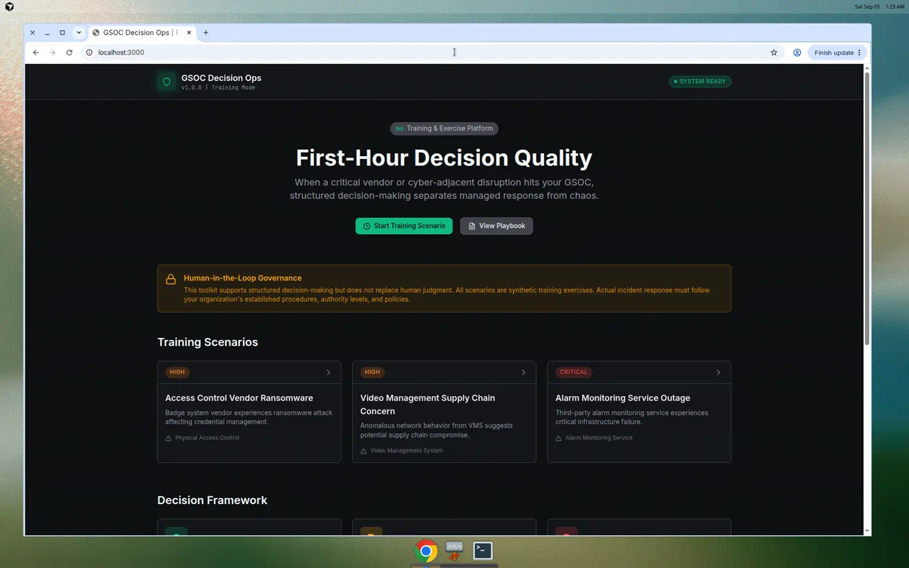
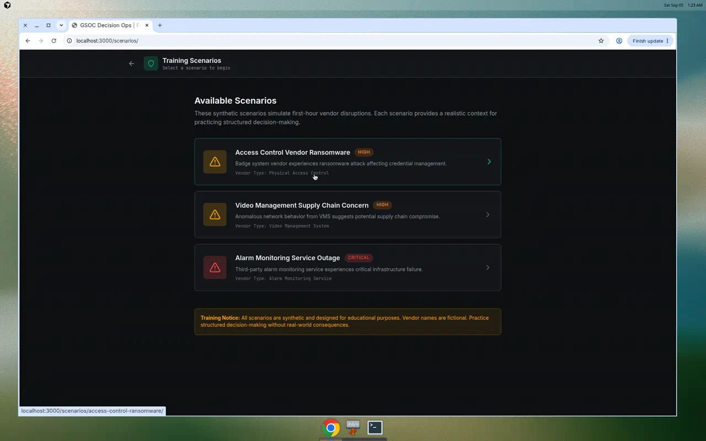
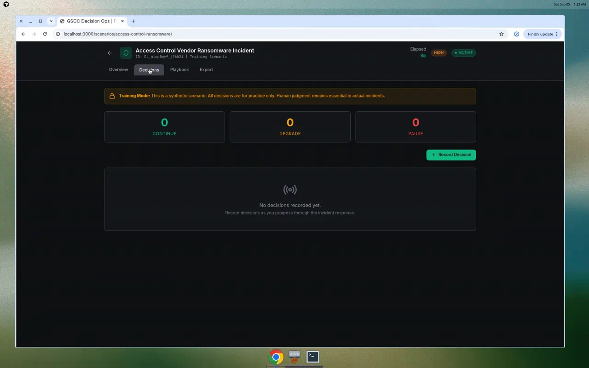
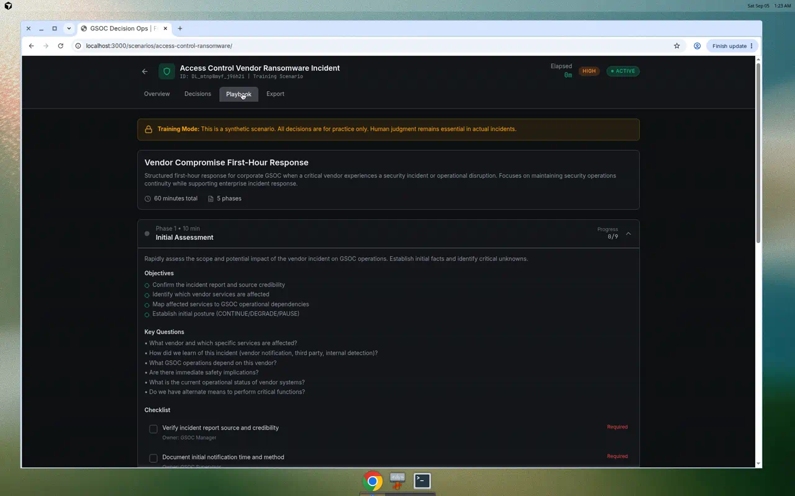

# GSOC Decision Ops Cloud

[](https://github.com/swb2019/gsoc-decision-ops/actions/workflows/ci.yml)
[](https://github.com/swb2019/gsoc-decision-ops/actions/workflows/deploy.yml)
[](https://opensource.org/licenses/MIT)
[](https://www.typescriptlang.org/)

**A SaaS-style decision-making platform for corporate Global Security Operations Centers (GSOC). Train your team with synthetic vendor compromise scenarios and structured first-hour response playbooks.**

> ⚡ **Portfolio Demo**: This is a demonstration of SaaS product development skills. All data is synthetic for training purposes. No real subscriptions or payments are processed.

[**🚀 Live Demo**](https://swb2019.github.io/gsoc-decision-ops/) | [Documentation](#architecture) | [Contributing](CONTRIBUTING.md)


_Multi-tenant SaaS interface with workspace management, role-based access, and structured decision logging_

---

## The Challenge

When a critical vendor experiences a security incident or service disruption, GSOC leaders must make rapid operational decisions with incomplete information. The first hour is critical—decisions made under pressure ripple through access control, video surveillance, alarm monitoring, and executive protection operations.

**Common pain points:**

- Scattered decision-making across Slack threads and spreadsheets
- No structured audit trail for after-action review
- Assumptions mixed with facts, creating hidden risk
- Inconsistent handoffs between shifts and stakeholders

## The Solution

GSOC Decision Ops provides a **structured framework** for first-hour response that:

1. **Separates facts from assumptions** with explicit risk documentation
2. **Enforces decision postures** (CONTINUE / DEGRADE / PAUSE) with rationale capture
3. **Guides response** through a vendor compromise playbook with phase-by-phase checklists
4. **Generates audit-ready exports** in Markdown and JSON for after-action review

This is a **training and exercise tool**—all scenarios are synthetic. The framework demonstrates operational decision-making methodology applicable to real-world GSOC environments.

## What This Is / What This Is Not

| This Is                                               | This Is Not                                     |
| ----------------------------------------------------- | ----------------------------------------------- |
| A decision-support framework for GSOC operations      | A SIEM, SOAR, or production security platform   |
| Training scenarios for vendor compromise response     | Real incident data or threat intelligence       |
| Structured methodology for first-hour decisions       | Automated decision-making or AI recommendations |
| An educational demonstration of ESRM principles       | A replacement for organizational IR procedures  |
| A TypeScript monorepo showcasing modern dev practices | Production-deployed enterprise software         |

---

## Quick Start

```bash
# Clone the repository
git clone https://github.com/swb2019/gsoc-decision-ops.git
cd gsoc-decision-ops

# Install dependencies
npm install

# Run the development server
npm run dev

# Open http://localhost:3000
```

### Available Commands

| Command             | Description                |
| ------------------- | -------------------------- |
| `npm run dev`       | Start development server   |
| `npm run build`     | Build all packages         |
| `npm test`          | Run test suite (109 tests) |
| `npm run typecheck` | TypeScript type checking   |
| `npm run lint`      | ESLint code analysis       |
| `npm run format`    | Prettier code formatting   |

---

## Architecture

### SaaS Product Architecture



### SaaS Features Implemented

| Feature               | Description                                          | Status      |
| --------------------- | ---------------------------------------------------- | ----------- |
| **Marketing Landing** | Hero, features, how-it-works, comparison table       | ✅ Complete |
| **Auth UX**           | Sign-in/sign-up with magic link simulation           | ✅ Complete |
| **App Shell**         | Sidebar navigation, workspace switcher, org selector | ✅ Complete |
| **Multi-Workspace**   | Multiple workspaces per organization                 | ✅ Complete |
| **Role-Based UI**     | GSOC Manager, Supervisor, Analyst, Viewer roles      | ✅ Complete |
| **Team Management**   | Member list with roles and activity status           | ✅ Complete |
| **Settings Console**  | Profile, org, notifications, security, billing tabs  | ✅ Complete |
| **Billing Stub**      | Pricing page with demo-only disclaimer               | ✅ Complete |
| **Dashboard**         | Incident stats, activity feed, quick actions         | ✅ Complete |
| **Playbook Library**  | Available and coming-soon playbooks                  | ✅ Complete |
| **Reports**           | After-action report list with export options         | ✅ Complete |

> **Note**: All SaaS features are UI demonstrations. No backend services, databases, or payment processing are implemented. Data persists only in browser session/localStorage.

### Monorepo Structure

```
gsoc-decision-ops/
├── apps/
│   └── web/                        # Next.js 14 web application
│       ├── src/app/                # App router pages
│       │   ├── page.tsx            # Marketing landing page
│       │   ├── signin/             # Demo sign-in
│       │   ├── signup/             # Demo sign-up
│       │   ├── pricing/            # Pricing page (demo)
│       │   ├── app/                # Authenticated app shell
│       │   │   ├── page.tsx        # Dashboard
│       │   │   ├── incidents/      # Incident management
│       │   │   ├── playbooks/      # Playbook library
│       │   │   ├── reports/        # After-action reports
│       │   │   ├── team/           # Team management
│       │   │   └── settings/       # Settings console
│       │   ├── scenarios/          # Training scenarios
│       │   └── playbook/           # Playbook viewer
│       ├── src/components/
│       │   ├── layout/             # Sidebar, AppShell
│       │   └── marketing/          # Landing page components
│       └── src/lib/                # Auth context, demo data
├── packages/
│   └── core/                       # Core TypeScript library
│       ├── src/
│       │   ├── decision-log.ts     # Log management functions
│       │   ├── playbooks/          # Response playbooks
│       │   ├── scenarios/          # Synthetic scenarios
│       │   ├── export.ts           # Report generation
│       │   ├── validation.ts       # Schema validation
│       │   └── types.ts            # Type definitions
│       └── __tests__/              # 109 test cases
├── docs/                           # Documentation & images
└── examples/                       # Sample data files
```

---

## Decision Log Schema

The core data model captures structured incident response data:

```typescript
interface DecisionLog {
  id: string;
  incident: {
    title: string;
    severity: 'CRITICAL' | 'HIGH' | 'MEDIUM' | 'LOW';
    status: 'ACTIVE' | 'MONITORING' | 'RESOLVED' | 'CLOSED';
  };

  facts: Fact[]; // Verified information with sources
  assumptions: Assumption[]; // Working assumptions with risk-if-wrong
  unknowns: Unknown[]; // Questions requiring resolution
  decisions: Decision[]; // Posture decisions with rationale
  actionItems: ActionItem[]; // Tracked tasks
  timeline: TimelineEvent[]; // Chronological record

  metadata: {
    exerciseMode: boolean; // Training indicator
    syntheticScenario: boolean; // Synthetic data flag
  };
}
```

### Decision Postures

| Posture      | Description                     | When to Use                                    |
| ------------ | ------------------------------- | ---------------------------------------------- |
| **CONTINUE** | Proceed with normal operations  | No immediate impact identified                 |
| **DEGRADE**  | Operate with reduced capability | Partial impact, compensating controls in place |
| **PAUSE**    | Halt affected operations        | Critical impact, unacceptable risk             |

---

## Screenshots

<details>
<summary>View Application Screenshots</summary>

### Home Page



### Scenario Selection



### Decision Log Interface


### Decision Recording



### Playbook Checklist



</details>

---

## Vendor Compromise Playbook

The included playbook provides a 60-minute structured response framework:

| Phase                           | Duration | Focus                                    |
| ------------------------------- | -------- | ---------------------------------------- |
| **1. Initial Assessment**       | 10 min   | Scope identification, initial posture    |
| **2. Stakeholder Notification** | 10 min   | Communication, bridge setup              |
| **3. Operational Continuity**   | 15 min   | Backup procedures, compensating controls |
| **4. Information Management**   | 15 min   | Data assessment, credential review       |
| **5. First Hour Checkpoint**    | 10 min   | Decision review, ongoing cadence         |

Each phase includes objectives, key questions, and checklists with ownership assignments.

---

## Comparison: Structured vs. Ad-Hoc Response

| Aspect                    | Ad-Hoc (Slack/Email/Excel) | GSOC Decision Ops                              |
| ------------------------- | -------------------------- | ---------------------------------------------- |
| **Decision Audit Trail**  | Scattered across channels  | Centralized, timestamped log                   |
| **Facts vs. Assumptions** | Often conflated            | Explicitly separated with risk documentation   |
| **Posture Clarity**       | Implicit, verbal           | Explicit CONTINUE/DEGRADE/PAUSE with rationale |
| **Handoff Quality**       | Dependent on individuals   | Structured log with timeline                   |
| **After-Action Review**   | Manual reconstruction      | Auto-generated reports                         |
| **Training Consistency**  | Variable                   | Repeatable synthetic scenarios                 |

---

## Training Scenarios

Three synthetic scenarios are included for practice:

1. **Access Control Vendor Ransomware** - Critical vendor providing badge access systems reports ransomware infection
2. **Video Management Compromise** - Security camera vendor discovers unauthorized access to cloud infrastructure
3. **Alarm Monitoring Outage** - Central station monitoring service experiences suspicious service degradation

All scenarios are **fictional** and designed for educational purposes. Vendor names are synthetic.

---

## Technology Stack

- **Framework**: Next.js 14 (App Router)
- **Language**: TypeScript 5.3
- **Styling**: Tailwind CSS
- **Testing**: Vitest (109 tests)
- **Build**: npm workspaces monorepo
- **CI/CD**: GitHub Actions
- **Deployment**: GitHub Pages (static export)

---

## Author

**Shannon Brown**  
GSOC Manager | Harvard ALM/ALB | Cyber Graduate Certificate  
CompTIA CySA+ | CompTIA Security+

This project demonstrates structured operational decision-making methodology for corporate security operations, combining GSOC domain expertise with modern software engineering practices.

---

## License

MIT License - See [LICENSE](LICENSE) for details.

---

## Contributing

Contributions are welcome! Please read [CONTRIBUTING.md](CONTRIBUTING.md) for guidelines.

Key areas for contribution:

- Additional synthetic scenarios
- Playbook enhancements
- Accessibility improvements
- Documentation

---

## Acknowledgments

This toolkit draws on established frameworks from:

- ASIS Enterprise Security Risk Management (ESRM)
- NIST Incident Response lifecycle
- Corporate GSOC operational best practices

The structured decision log approach is influenced by military after-action review methodology and high-reliability organization (HRO) principles.
