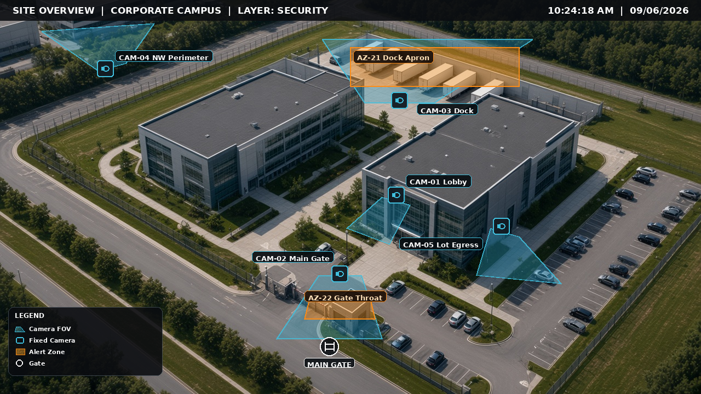

# Hourglass Command

**First-hour judgment under incomplete information.**

[](https://github.com/swb2019/gsoc-decision-ops/actions/workflows/ci.yml)
[](https://github.com/swb2019/gsoc-decision-ops/actions/workflows/deploy.yml)
[](https://opensource.org/licenses/MIT)

[**Live demonstration**](https://swb2019.github.io/gsoc-decision-ops/) · Shannon Brown

<p align="center">
  
</p>

---

## Purpose

When physical, cyber, and intelligence channels converge, GSOC leaders must decide with partial facts, contested assumptions, and real consequence. Production rarely offers clean repetitions of that hour.

**Hourglass Command** is a decision simulation for that problem: structured posture calls, an explicit decision log, and after-action documentation that can withstand scrutiny.

It is a **training simulation** — not a system of record, not a vendor suite, and not a substitute for operational authority.

---

## What leaders practice

- Separating **facts**, **assumptions**, and **unknowns** under time pressure
- Committing a defensible posture: **CONTINUE** · **DEGRADE** · **PAUSE** (ESRM-aligned treatment logic)
- Managing fused intake pressure across access, video, alarm, SIEM, OSINT, tips, and radio-class injects
- Seeing consequence on trust, KRIs, and the common operating picture
- Producing an after-action artifact suitable for leadership review

Pedagogy and methodology notes: [docs/TRAINING.md](docs/TRAINING.md) (when present).

---

## Design bar

| Principle             | Application                                                |
| --------------------- | ---------------------------------------------------------- |
| Judgment over tooling | The product measures decision quality, not console theatre |
| ESRM fidelity         | Asset-owner risk ownership; GSOC advises on residual risk  |
| Honesty               | Closed defaults; no fabricated customers or payments       |
| Operable surface      | Dense first-hour injects; learnable without a manual       |

Spoken Intel Feed, light guidance, and optional 3D COP markers support attention — they do not replace the decision.

---

## Run

**Browser:** [swb2019.github.io/gsoc-decision-ops](https://swb2019.github.io/gsoc-decision-ops/)

**Local:**

```bash
git clone https://github.com/swb2019/gsoc-decision-ops.git
cd gsoc-decision-ops
npm install
npm run dev
```

| Command         | Purpose       |
| --------------- | ------------- |
| `npm run dev`   | Local server  |
| `npm test`      | Test suite    |
| `npm run build` | Static export |

---

## Architecture

```
apps/web/         Next.js application (static export)
packages/core/    Domain logic — scenarios, scoring, ESRM, arc scheduling
docs/             Training and product documentation
```

**Stack:** TypeScript · Next.js · Tailwind CSS · Vitest

---

## Author

**Shannon Brown** — GSOC / crisis management and intelligence practice. Hourglass Command is built as both working software and a public demonstration of operational decision craft.

---

## License

MIT
