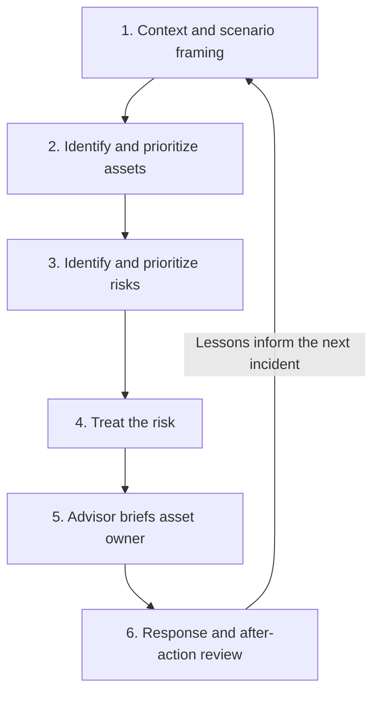

# Hourglass Command — Training Methodology

[Project overview](../README.md) · [Live simulation](https://swb2019.github.io/gsoc-decision-ops/) · [Contributing](../CONTRIBUTING.md)

> **Version:** 2.0 (ESRM Textbook-Faithful)  
> **Effective:** September 2026  
> **Purpose:** Document the ESRM textbook-faithful pedagogical foundations for first-hour decision training.

---

## Training Philosophy

Hourglass Command is a **leading ESRM textbook-faithful** training simulation built on:

1. **ASIS ESRM Guidelines** — International framework where asset owners own risk
2. **Allen & Loyear's "Enterprise Security Risk Management: Concepts and Applications"**
3. **Loyear's "Enterprise Security Risk Management in the Real World"**

The simulation operationalizes the complete ESRM cycle as playable mechanics — not brochureware, but actual gameplay where you practice each step under time pressure.

**Foundation Stack:**

| Layer          | Foundation                              | Application in Simulation                                       |
| -------------- | --------------------------------------- | --------------------------------------------------------------- |
| **Workflow**   | Enterprise incident management patterns | Decision log, timeline, ownership, escalation cues, COP         |
| **Risk**       | ASIS ESRM principles                    | Asset owner owns risk; GSOC = trusted advisor; all 4 treatments |
| **Pedagogy**   | Klein RPD, military AAR, HSEEP tabletop | Injects, structured debrief, treatment framing                  |
| **First-Hour** | NIST/CISA incident guidance             | 5-phase playbook progression                                    |

This document maps each feature to its pedagogical foundation, enabling trainers to understand _why_ the tool works, not just _how_ to use it.

---

## §0 The ESRM Cycle (Practiced In-Sim)

The complete ESRM cycle is playable, not brochure content. Each step has corresponding game mechanics:



| Cycle Step                      | In-Sim Mechanic                                           | Scoring Impact     |
| ------------------------------- | --------------------------------------------------------- | ------------------ |
| 1. Context                      | Scenario framing, learning objective visible              | —                  |
| 2. Identify & Prioritize Assets | Asset selection with criticality badges, owner info       | Required           |
| 3. Identify & Prioritize Risks  | T×V×I quick view, urgency badges, risk level calculation  | Informs decision   |
| 4. Treat the Risk               | All 4 treatments playable: Accept/Mitigate/Transfer/Avoid | +150 base          |
| 5. Advisor → Asset Owner        | Brief button, affirmation workflow, governance reminder   | +75 ESRM bonus     |
| 6. Response & Review            | Residual risk documentation, AAR export, lessons learned  | +50 residual bonus |

---

## §1 Foundation Stack

### 1.1 Enterprise Incident Management Patterns

**Source:** Enterprise Security Risk Management (ESRM) platforms; incident management workflow design

**Workflow elements trained (pedagogy, not feature parity):**

| Element                      | Training Implementation                                     |
| ---------------------------- | ----------------------------------------------------------- |
| **Decision log**             | Timestamped decision capture with posture, rationale, owner |
| **Timeline**                 | Chronological event tracking with type classification       |
| **Ownership**                | Explicit owner/role on every decision and action            |
| **Escalation cues**          | Inject system surfaces escalation triggers                  |
| **Common Operating Picture** | Facts/Assumptions/Unknowns panels with shared language      |
| **Case structure**           | Scenario → Assessment → Decision → Export flow              |

**What this does NOT train (belongs in full platform):**

- Case creation and dispatch
- Multi-incident triage
- Risk assessments (formal, scored)
- Third-party integrations
- Audit trails and compliance reporting

---

### 1.2 ASIS ESRM Risk Principles

**Source:** ASIS International _Enterprise Security Risk Management_ (2019); Allen & Loyear textbooks; ISO 31000

**Core ESRM principles applied:**

| ESRM Principle                   | Training Implementation                                            |
| -------------------------------- | ------------------------------------------------------------------ |
| **Asset owner owns the risk**    | Explicit advisor → owner handoff workflow with affirmation         |
| **Security = trusted advisor**   | GSOC posture is recommendation to business, not unilateral control |
| **Residual risk explicit**       | Required documentation: "risk remaining after this treatment"      |
| **All 4 treatments first-class** | Accept/Mitigate/Transfer/Avoid all playable in UI                  |

**ESRM treatment → Posture mapping (All 4 Treatments Playable):**

| ESRM Treatment | Posture  | When Applied                                            |
| -------------- | -------- | ------------------------------------------------------- |
| **Accept**     | CONTINUE | Risk within tolerance; proceed with awareness           |
| **Mitigate**   | DEGRADE  | Apply compensating controls to reduce exposure          |
| **Transfer**   | DEGRADE  | Shift risk to third party (insurance, vendor liability) |
| **Avoid**      | PAUSE    | Eliminate the risk source entirely                      |

**Transfer Treatment (New):**

TRANSFER is now a first-class playable option. Use when:

- Insurance coverage exists for the risk type
- Vendor/contractor can better manage the risk
- Contractual liability shift is appropriate
- Specialized expertise needed beyond internal capability

**Note:** Responsibility for managing the risk may transfer, but accountability to stakeholders often remains. Document counterparty risk.

**Key insight:** GSOC doesn't own business risk — we advise asset owners on security implications. Training should reinforce this advisory role, not security overreach.

**Residual risk language in decisions:**

```
Posture: DEGRADE
Treatment: Transfer
Residual Risk: Vendor SLA invoked for 4-hour response; counterparty
               risk if vendor fails to perform. Insurance claim
               initiated for breach costs.
Recommendation to: VP Infrastructure (asset owner)
```

---

## §2 Pedagogical Approaches

### 2.1 Tabletop Exercise Design

**Source:** FEMA Homeland Security Exercise and Evaluation Program (HSEEP); industry tabletop facilitation best practices

**Principles applied:**

| Principle                                 | How Applied                                                                           |
| ----------------------------------------- | ------------------------------------------------------------------------------------- |
| **Single learning objective per session** | Each scenario has a declared learning objective visible at start                      |
| **Escalating injects**                    | 3–5 timed injects reveal new information, forcing posture reconsideration             |
| **Force specific decisions**              | Posture buttons (CONTINUE/DEGRADE/PAUSE) require commitment—no "we'd just coordinate" |
| **Communication/coordination pressure**   | Joint-bridge checklist surfaces stakeholder coordination requirements                 |
| **Immediate debrief**                     | Export AAR provides structured reflection within the session                          |

**Key insight:** Effective tabletop exercises don't test knowledge—they force decisions under uncertainty, then examine the decision process.

---

### 2.2 Recognition-Primed Decision (RPD) Model

**Source:** Gary Klein, _Sources of Power: How People Make Decisions_ (1998); naturalistic decision-making research

**The RPD cycle:**

```
Situation → Cue Recognition → Pattern Match → Mental Simulation → Action
```

**How applied in Hourglass Command:**

| RPD Element              | Feature Implementation                                                               |
| ------------------------ | ------------------------------------------------------------------------------------ |
| **Cue recognition**      | COP (Common Operating Picture) separates Facts/Assumptions/Unknowns as explicit cues |
| **Pattern matching**     | Scenario context provides vendor type and impact categories for pattern activation   |
| **Mental simulation**    | RPD prompts ask "What do you expect to happen?" before posture selection             |
| **Satisficing**          | Three postures (CONTINUE/DEGRADE/PAUSE) enforce satisficing over optimization        |
| **Situation assessment** | Injects trigger reassessment—"Is my current posture still appropriate?"              |

**Key insight:** Experts don't optimize—they recognize patterns and simulate forward. Training should develop pattern libraries and simulation fluency.

---

### 2.3 Military/Organizational After-Action Review (AAR)

**Source:** U.S. Army Center for Army Lessons Learned; organizational learning research

**AAR structure applied:**

| AAR Question                 | Export Section                                              |
| ---------------------------- | ----------------------------------------------------------- |
| What was supposed to happen? | Intended outcomes (learning objective + expected decisions) |
| What actually happened?      | Chronology + actual decisions made                          |
| What went well? (Sustains)   | Sustains section with specific behaviors to continue        |
| What can improve? (Improves) | Improves section with identified gaps                       |
| Who owns what next?          | Action items with owner and due date                        |

**Key insight:** Learning happens in reflection, not execution. The AAR export is where decision patterns are examined and encoded.

---

### 2.4 NIST/CISA-Aligned First-Hour Discipline

**Source:** NIST Cybersecurity Framework; CISA Incident Response guidance; adapted for GSOC operational posture (not full IR forensics)

**First-hour phases (GSOC operational lens):**

| Phase       | Focus                                        | Duration  |
| ----------- | -------------------------------------------- | --------- |
| **Declare** | Confirm incident, establish initial posture  | 0–10 min  |
| **Assess**  | Scope impact, identify dependencies          | 10–20 min |
| **Bridge**  | Stakeholder notification, joint coordination | 20–35 min |
| **Brief**   | Executive communication, documentation       | 35–50 min |
| **Learn**   | First checkpoint, assumption validation      | 50–60 min |

**GSOC vs. IR distinction:** GSOC focuses on _operational continuity_ and _physical security posture_. Technical investigation remains with IT Security/IR teams. This tool trains the GSOC decision layer, not forensics.

---

### 2.5 Common Operating Picture (COP)

**Source:** Military command and control doctrine; crisis management research

**COP principles applied:**

| Principle                              | Implementation                                                         |
| -------------------------------------- | ---------------------------------------------------------------------- |
| **Facts vs. Assumptions vs. Unknowns** | Three distinct UI panels, not merged lists                             |
| **Required risk-if-wrong**             | Assumptions require explicit risk statement before entry               |
| **Source attribution**                 | Facts require source for credibility assessment                        |
| **Priority on unknowns**               | Unknowns carry priority (CRITICAL/HIGH/MEDIUM/LOW)                     |
| **Visual hierarchy**                   | Color-coded panels: green (facts), amber (assumptions), red (unknowns) |

**Key insight:** Decision quality depends on information quality awareness. Conflating facts with assumptions causes preventable failures.

---

### 2.6 Joint Bridge Coordination

**Source:** Incident Command System (ICS); corporate crisis management practices

**Joint-bridge checklist categories:**

| Stakeholder Group           | Coordination Items                                                         |
| --------------------------- | -------------------------------------------------------------------------- |
| **GSOC ↔ IR/IT Security**   | Technical lead handoff, evidence preservation, access suspension decisions |
| **GSOC ↔ Facilities**       | Building systems status, backup procedures, physical access impacts        |
| **GSOC ↔ Communications**   | Internal messaging, executive briefing schedule, external notification     |
| **GSOC ↔ Legal/Compliance** | Regulatory notification triggers, documentation requirements               |
| **GSOC ↔ Vendor**           | Vendor contact, status updates, SLA documentation                          |

**Key insight:** First-hour failures often occur at organizational seams. The joint-bridge checklist makes coordination explicit and trackable.

---

### 2.7 Realistic Intake Channel Simulation

**Source:** GSOC operations workflow; PSIM/SIEM integration patterns; enterprise incident management

**Pedagogical goal:** Operators must understand not just _what_ happened, but _how they learned about it_. Source system characteristics affect confidence assessment, triage priority, and verification requirements.

**Intake channels simulated (original names; no vendor trademarks):**

| Channel        | System Types                   | Confidence Profile | Training Focus                    |
| -------------- | ------------------------------ | ------------------ | --------------------------------- |
| **ACS**        | Badge readers, access control  | HIGH               | Physical access anomalies         |
| **VMS**        | Cameras, analytics             | MEDIUM             | Visual correlation, context       |
| **ALARM**      | Intrusion, duress, supervisory | HIGH               | Life-safety priority              |
| **SIEM**       | Cyber security, UEBA, DLP      | MEDIUM             | Cross-domain correlation          |
| **OSINT**      | Intel desk, dark web, media    | MEDIUM             | Source reliability assessment     |
| **TIP**        | Hotline, email, chat           | LOW                | Incomplete info handling          |
| **RADIO**      | Dispatch, officer mobile       | HIGH               | Real-time field coordination      |
| **FACILITIES** | BMS, HVAC, fire, elevator      | HIGH               | Life-safety / business continuity |

**Key pedagogical elements:**

| Element                   | Implementation                                                    |
| ------------------------- | ----------------------------------------------------------------- |
| **Confidence indicators** | VERIFIED → HIGH → MEDIUM → LOW → UNVERIFIED → CONFLICTING         |
| **Completeness tracking** | COMPLETE → PARTIAL → MINIMAL → FRAGMENT                           |
| **Corrections/updates**   | UPDATE badge links to prior inject; revised assessment            |
| **Noise vs. signal**      | Routine items (scheduled maintenance, verified deliveries) appear |
| **Attachments**           | Simulated stills, map pins, log excerpts, documents               |
| **Source system feel**    | Realistic system names, source IDs, timestamps                    |

**Key insight:** Effective triage requires source literacy. Knowing that VMS analytics have higher false-positive rates than ACS alarms affects how you prioritize and verify. Conflicting intel from different channels forces explicit confidence assessment.

---

## §3 Feature-to-Pedagogy Mapping

| Feature                              | Primary Foundation        | Secondary Foundations             |
| ------------------------------------ | ------------------------- | --------------------------------- |
| Decision log with timestamp/owner    | Enterprise workflow       | Military AAR                      |
| Timeline event tracking              | Enterprise workflow       | NIST first-hour discipline        |
| Learning objective per scenario      | Tabletop design           | —                                 |
| Timed injects with urgency badges    | Tabletop design           | RPD (situation reassessment)      |
| Facts/Assumptions/Unknowns panels    | COP                       | RPD (cue recognition)             |
| Risk Matrix quick view (T×V×I)       | ASIS ESRM risk assessment | ISO 31000                         |
| All 4 treatments playable            | ASIS ESRM textbook        | Allen & Loyear                    |
| CONTINUE/DEGRADE/PAUSE postures      | ESRM treatment mapping    | RPD (satisficing)                 |
| TRANSFER treatment option            | ESRM risk transfer        | Insurance/contract best practices |
| Asset selection with criticality     | ESRM asset prioritization | Allen & Loyear                    |
| Advisor → Owner handoff workflow     | ESRM core principle       | ASIS governance model             |
| Owner affirmation tracking           | ESRM accountability       | Audit trail requirements          |
| Residual risk documentation          | ESRM principles           | Enterprise workflow               |
| Asset owner briefing bonus           | ESRM discipline           | Tabletop design (force decisions) |
| Playbook phases (5-phase)            | NIST first-hour           | Tabletop design (structure)       |
| Entity linking across injects        | COP                       | Intel analysis tradecraft         |
| Dispatch pressure/resources          | Tabletop realism          | Resource management               |
| Intake channel badges                | GSOC workflow realism     | Source literacy                   |
| Confidence/completeness indicators   | Intel analysis tradecraft | Information quality assessment    |
| Corrections/updates to prior injects | COP update discipline     | Dynamic situational awareness     |
| Noise injects (routine items)        | Triage discipline         | Attention management              |
| Simulated attachments                | Evidence handling         | Visual correlation                |
| Escalation path indicators           | Enterprise workflow       | ESRM escalation governance        |
| AAR with lessons learned             | Military AAR              | ESRM continuous improvement       |
| Continuous improvement tracking      | ESRM cycle completion     | Allen & Loyear maturity model     |
| ESRM Field Guide (textbook chapters) | ESRM pedagogy             | Adult learning principles         |

---

## §4 What This Training Is NOT

| Not This                              | Because                                                                          |
| ------------------------------------- | -------------------------------------------------------------------------------- |
| **SIEM/SOAR simulation**              | No log parsing, alert triage, or detection logic—this is decision training       |
| **IR forensics training**             | GSOC doesn't lead technical investigation; we train operational posture          |
| **Interpersonal leadership practice** | No simulation of exec relationships, stakeholder politics, or workforce dynamics |
| **People-management training**        | Team/staffing scenarios are not modeled; focus is operator decision quality      |
| **Soft-skill communication coaching** | Does not coach negotiation, conflict resolution, or relationship-building        |
| **Certification prep**                | Not mapped to CISSP/CISM domains; teaches judgment, not recall                   |
| **Policy generator**                  | Export is for reflection, not production incident documentation                  |
| **Gamified learning**                 | No points, badges, or leaderboards—decision quality is the reward                |

**Scope clarification:** The simulation trains the _technical_ side of GSOC decision-making — intake triage, COP discipline, risk treatment selection, playbook execution, and defensible documentation. It does not simulate interpersonal dynamics with executive leadership, workforce management relationships, or the stakeholder negotiation that real security directors navigate alongside technical judgment. Leadership _competency framing_ exists as instructional content (ESRM advisory model, asset-owner briefing), but actual soft-skill practice is out of scope.

---

## §5 Glossary of Acronyms

Quick reference for security operations terminology used throughout Hourglass Command.

| Acronym   | Full Term                                        | Definition                                                                                     |
| --------- | ------------------------------------------------ | ---------------------------------------------------------------------------------------------- |
| **AAR**   | After-Action Review                              | Structured debrief to capture lessons learned after an incident or exercise                    |
| **ACS**   | Access Control System                            | Electronic system that manages physical entry to secured areas                                 |
| **ASIS**  | ASIS International                               | Global organization for security professionals, publisher of ESRM guidelines                   |
| **BCP**   | Business Continuity Plan                         | Strategy for maintaining operations during disruptions                                         |
| **BMS**   | Building Management System                       | Centralized system controlling HVAC, lighting, and other building functions                    |
| **CISA**  | Cybersecurity and Infrastructure Security Agency | US federal agency for cyber and physical security                                              |
| **COP**   | Common Operating Picture                         | Shared situational awareness display showing facts, assumptions, and unknowns                  |
| **DR**    | Disaster Recovery                                | Process for restoring systems after major incidents                                            |
| **ESRM**  | Enterprise Security Risk Management              | Holistic approach where security advises asset owners who own risk decisions                   |
| **ETA**   | Estimated Time of Arrival                        | Projected time for resource or personnel arrival                                               |
| **GSOC**  | Global Security Operations Center                | Centralized facility for monitoring and coordinating security operations                       |
| **ICS**   | Incident Command System                          | Standardized management structure for emergency response                                       |
| **IOC**   | Indicator of Compromise                          | Artifact indicating potential security breach                                                  |
| **IR**    | Incident Response                                | Coordinated approach to managing security incidents                                            |
| **MFA**   | Multi-Factor Authentication                      | Security requiring multiple verification methods for access                                    |
| **NIST**  | National Institute of Standards and Technology   | US agency developing security frameworks and standards                                         |
| **OSINT** | Open-Source Intelligence                         | Information gathered from publicly available sources                                           |
| **RPD**   | Recognition-Primed Decision                      | Decision model where experts recognize patterns and mentally simulate outcomes                 |
| **SIEM**  | Security Information and Event Management        | Platform aggregating and analyzing security logs                                               |
| **SLA**   | Service Level Agreement                          | Contractual commitment defining expected service standards                                     |
| **SOC**   | Security Operations Center                       | Facility for monitoring and responding to security threats                                     |
| **SOP**   | Standard Operating Procedure                     | Documented step-by-step instructions for routine operations                                    |
| **TTPs**  | Tactics, Techniques, and Procedures              | Patterns describing adversary behavior                                                         |
| **T×V×I** | Threat × Vulnerability × Impact                  | Risk calculation formula: likelihood of threat exploiting vulnerability times potential impact |
| **VMS**   | Video Management System                          | Software platform for managing surveillance camera feeds and recordings                        |

---

## §6 References

### ESRM Primary Sources

1. **ASIS International. (2019). _Enterprise Security Risk Management: A Context-Based Approach._** — The foundational ESRM framework this simulation implements.
2. **Allen, B., & Loyear, R. (2016). _Enterprise Security Risk Management: Concepts and Applications._ Rothstein Publishing.** — Comprehensive textbook on ESRM implementation.
3. **Loyear, R. (2020). _Enterprise Security Risk Management in the Real World._ Rothstein Publishing.** — Practical application of ESRM principles.

### Decision Science Sources

4. Klein, G. (1998). _Sources of Power: How People Make Decisions._ MIT Press.
5. Klein, G. (2017). _Seeing What Others Don't: The Remarkable Ways We Gain Insights._ PublicAffairs.
6. Kahneman, D. (2011). _Thinking, Fast and Slow._ Farrar, Straus and Giroux.

### Incident Management Sources

7. U.S. Army. (2020). _A Leader's Guide to After-Action Reviews._ Center for Army Lessons Learned.
8. FEMA. (2020). _Homeland Security Exercise and Evaluation Program (HSEEP)._ Department of Homeland Security.
9. NIST. (2018). _Framework for Improving Critical Infrastructure Cybersecurity._ NIST Cybersecurity Framework 1.1.
10. CISA. (2021). _Federal Government Cybersecurity Incident and Vulnerability Response Playbooks._

### Supporting Research

- Weick, K. E., & Sutcliffe, K. M. (2015). _Managing the Unexpected._ Wiley.
- Woods, D. D., & Hollnagel, E. (2006). _Joint Cognitive Systems: Patterns in Cognitive Systems Engineering._ CRC Press.
- ISO 31000:2018. _Risk management — Guidelines._ International Organization for Standardization.

---

## §5 Trainer Notes

### Recommended Session Flow

1. **Pre-brief (2 min):** Review scenario learning objective, explain synthetic nature
2. **Exercise (15–25 min):** Work through scenario, injects auto-reveal or facilitator-triggered
3. **Hot wash (5 min):** Immediate verbal debrief while memory is fresh
4. **Export AAR (2 min):** Generate structured after-action report
5. **Review (10 min):** Examine AAR, identify patterns, document action items

### Facilitator Anti-Patterns

| Anti-Pattern                 | Why Harmful                | Instead                  |
| ---------------------------- | -------------------------- | ------------------------ |
| Giving hints                 | Removes decision pressure  | Ask clarifying questions |
| Accepting "we'd coordinate"  | Avoids commitment          | Force specific posture   |
| Rushing injects              | Doesn't allow processing   | Let discomfort build     |
| Skipping AAR                 | Misses learning moment     | Always export and review |
| Adding scenarios mid-session | Dilutes learning objective | One scenario per session |

---

## §6 ESRM Textbook Coverage Map

This simulation now covers the following ESRM textbook content:

| ESRM Concept                       | Textbook Reference   | In-Sim Status      |
| ---------------------------------- | -------------------- | ------------------ |
| Asset Identification               | Allen & Loyear Ch. 3 | ✅ Playable        |
| Asset Prioritization (Criticality) | Allen & Loyear Ch. 3 | ✅ Playable        |
| Risk Assessment (T×V×I)            | ASIS ESRM §4.2       | ✅ Visual          |
| 5×5 Risk Matrix                    | ISO 31000; ASIS      | ✅ Field Guide     |
| Accept Treatment                   | Allen & Loyear Ch. 5 | ✅ Playable        |
| Mitigate Treatment                 | Allen & Loyear Ch. 5 | ✅ Playable        |
| Transfer Treatment                 | Allen & Loyear Ch. 5 | ✅ Playable (NEW)  |
| Avoid Treatment                    | Allen & Loyear Ch. 5 | ✅ Playable        |
| Advisor → Owner Model              | ASIS ESRM §2.1       | ✅ Playable        |
| Residual Risk Documentation        | Allen & Loyear Ch. 6 | ✅ Playable        |
| Post-Incident Review               | Allen & Loyear Ch. 8 | ✅ AAR             |
| Continuous Improvement             | ASIS ESRM §7         | ✅ Lessons Learned |

### Still Thin (Future PRD)

| ESRM Concept                 | Textbook Reference   | Status                 |
| ---------------------------- | -------------------- | ---------------------- |
| Formal Risk Register         | Allen & Loyear Ch. 4 | ⏸️ Closed (scope)      |
| Quantitative Risk Assessment | ISO 31000            | ⏸️ Closed (complexity) |
| Multi-scenario Campaigns     | HSEEP                | ⏸️ Closed (PRD 2.0)    |

---

## §7 Key Risk Indicators (KRIs)

The simulation tracks Key Risk Indicators to provide glanceable, traffic-light health metrics during incident response. KRIs are aligned to ESRM/ops practice per industry standards.

### Traffic Light System

| Status | Meaning                     | Action Required                    |
| ------ | --------------------------- | ---------------------------------- |
| GREEN  | Within tolerance            | Continue monitoring                |
| AMBER  | Warning threshold breached  | Investigate, consider intervention |
| RED    | Critical threshold breached | Immediate attention required       |

### Leading Indicators (Predictive)

| KRI                 | Definition                                               | Target       |
| ------------------- | -------------------------------------------------------- | ------------ |
| MTTA                | Mean Time To Acknowledge — seconds from inject to action | < 30s        |
| Open Critical       | Unhandled IMMEDIATE priority injects                     | 0            |
| Dispatch Contention | Resource strain across guards/analysts/responders        | < 25%        |
| Escalation Level    | Activity (1) → Incident (2) → Investigation (3)          | Match threat |
| Channel Signal      | Ratio of verified facts to assumptions/unknowns          | > 70%        |

### Lagging Indicators (Outcomes)

| KRI                 | Definition                                                    | Target |
| ------------------- | ------------------------------------------------------------- | ------ |
| MTTR                | Mean Time To Resolve — seconds from first inject to stability | < 300s |
| Residual Rate       | Decisions with explicit residual risk documentation           | > 80%  |
| Owner Briefing      | Decisions with asset owner engagement                         | > 80%  |
| Treatment Diversity | Use of multiple treatment options                             | > 50%  |

### Pedagogical Application

KRIs surface decision-useful signals without becoming vanity dashboards. Per Musk 5-step: only metrics that change judgment. The traffic-light system provides immediate visual feedback on response health, enabling players to self-correct during simulation.

---

## §8 ESRM Value Metrics

The simulation tracks underlying business value created during incident response—not vanity SaaS metrics. Value metrics make security's contribution visible to stakeholders.

### Value Categories

| Category              | Definition                                     | Example Indicators                  |
| --------------------- | ---------------------------------------------- | ----------------------------------- |
| Mission Continuity    | Operational state maintained during incident   | OPERATIONAL → DEGRADED → HALTED     |
| Residual Risk         | Explicit documentation of remaining risk       | Explicitness rate %                 |
| Owner Affirmation     | Asset owners briefed per ESRM governance       | Briefing rate %, affirmation rate % |
| Avoided Loss Proxies  | Estimated losses prevented by timely decisions | Safety incidents, breaches avoided  |
| Advisor Effectiveness | Quality of security advisory function          | Recommendation acceptance rate %    |

### Composite Value Score

The Composite Value Score is a weighted combination:

- Mission Continuity Score (25%)
- Residual Risk Explicitness (20%)
- Governance Compliance (20%)
- Avoided Loss Impact (15%)
- Advisor Acceptance Rate (20%)

### Pedagogical Application

Value metrics reinforce that security exists to protect business value, not to accumulate vanity numbers. Players learn to articulate security's contribution in terms stakeholders understand: protected operations, managed risk, prevented losses.

---

## §9 Data Pipeline Health

The simulation models realistic data pipeline stages based on enterprise security software patterns. Pipeline health shows subtle realism without becoming a production admin console.

### Pipeline Stages

```
Source → Normalize → Enrich → Correlate → Triage → Case → Decision → AAR
```

| Stage     | Function                                          | Health Metrics           |
| --------- | ------------------------------------------------- | ------------------------ |
| Source    | Raw event ingestion from ACS/VMS/SIEM/alarm/OSINT | Events received, latency |
| Normalize | Schema standardization, field mapping             | Processing rate          |
| Enrich    | Context addition: asset info, threat intel, geo   | Enrichment miss rate     |
| Correlate | Cross-source correlation, entity linking          | Correlation hit rate     |
| Triage    | Priority sorting, analyst routing                 | Queue depth              |
| Case      | Incident bundling, workflow assignment            | Throughput               |
| Decision  | COP integration, posture selection                | Decision rate            |
| AAR       | After-action review, lessons learned              | Feedback rate            |

### Source Channels

Reflects realistic intake patterns from enterprise security systems (generic names, no trademark cosplay):

- Access Control (badge readers, doors)
- Video Management (camera feeds, analytics)
- Security Analytics (log aggregation, detection)
- Alarm Systems (intrusion detection, perimeter)
- Open Source Intel (dark web, social, news)
- Threat Intel (IOC feeds, advisories)
- Dispatch/CAD (guard dispatch, response)
- Human Intel (source reports, verbal briefings)

### Pedagogical Application

Pipeline health provides context for decision-making quality. High drop rates or enrichment misses explain why information quality may be degraded. Players learn that decision quality depends on information pipeline health—garbage in, garbage out.

---

_Hourglass Command — Training Methodology v3.0 (KRI + Value Metrics)_
